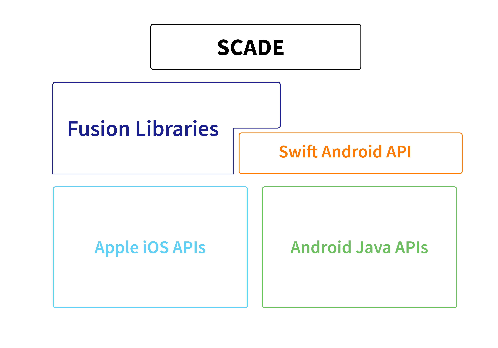
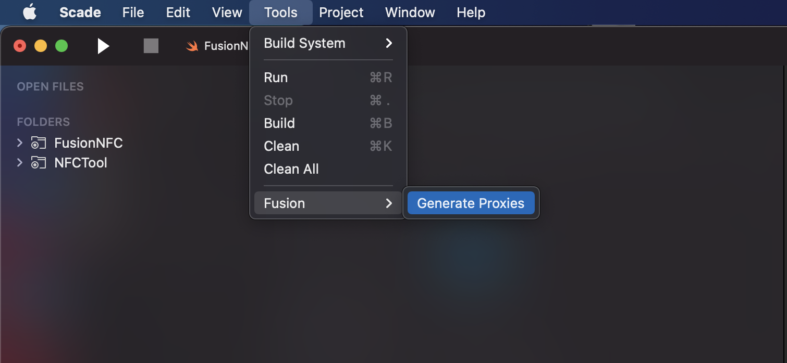

# Fusion


## What is Fusion?

SCADE enables the iOS developer to use the same Swift codebase to target Android apps. There is no need to learn Java/Kotlin and Android SDK for Swift developers who are using SCADE IDE to build apps. 

Recently, the SCADE team has gone open-source with their breakthrough technology called **[Fusion](https://docs.scade.io/docs/fusionintroduction)** libraries. Fusion enables us to invoke the Android APIs using the SCADE Fusion SDK. The benefit is we don’t have to bother about setting up the Android platform-specific stuff in the gradle or anywhere. Even iOS-specific settings are very easy and no further prerequisite is required for the same. 

Currently, [Fusion SDK](https://docs.scade.io/docs/fusion-library-overview) provides easy integrations for the Geolocation, Bluetooth, NFC, and Media Player, and many more Fusion libraries are in development by the SCADE developers. 

## Fusion Architecture

Fusion generates Swift Android API that maps to the Java Android API. So for each Swift method you call for iOS, SCADE automatically calls the mapped Android method when it is run on the Android platform. The following diagram depicts how the Fusion libraries are built on top of the Swift iOS and Java Android APIs.





`Swift-android` is the open-source repository where we have generated Swift APIs and methods for the Android SDK. You can easily use Swift Package Manager to integrate `swift-android` and call Android methods accordingly.  
[https://github.com/scade-platform/swift-android](https://github.com/scade-platform/swift-android)


### Add dependency in `Package.swift`
```swift
dependencies: [
        .package(name: "Android", url: "https://github.com/scade-platform/swift-android.git",.branch("android/24")) 
],
```

### Import Android Libraries

```swift
import Java
import Android
import AndroidOS
import AndroidApp
import AndroidContent
import AndroidNFC
```


## Benefits of using Fusion


* The APIs are automatically generated using our Fusion Generator
* No waiting time. Fusion Swift Android APIs are available when the Android Java API is available. You can use the feature right away
* Availability for multiple versions of the Android APIs. Thanks to `SPM`, you can link against different versions of Android API, depending on your requirements. 

## How Fusion generates Android API**


Fusion generator is present in the SCADE editor which analyzes the Android Java API  first and then from the `swift-android` repository, generates the corresponding mapped Swift methods for the Android API.  
SCADE editor provides the option to generate the Fusion proxies while creating Fusion libraries. You can access the option, _Tools -> Fusion -> Generate Proxies_.





## Fusion Libraries List


<table>
  <tr>
   <td><strong>S.No</strong>
   </td>
   <td><strong>Library Name</strong>
   </td>
   <td><strong>Repository</strong>
   </td>
   <td><strong>Description</strong>
   </td>
  </tr>
  <tr>
   <td>1
   </td>
   <td>FusionLocation
   </td>
   <td><a href="https://github.com/scade-platform/FusionLocation">https://github.com/scade-platform/FusionLocation</a> 
   </td>
   <td>Android & iOS Geolocation impl
   </td>
  </tr>
  <tr>
   <td>2
   </td>
   <td>FusionNFC
   </td>
   <td><a href="https://github.com/scade-platform/FusionNFC">https://github.com/scade-platform/FusionNFC</a> 
   </td>
   <td>NFC read/write impl for iOS and Android
   </td>
  </tr>
  <tr>
   <td>3
   </td>
   <td>FusionMedia
   </td>
   <td><a href="https://github.com/scade-platform/FusionMedia">https://github.com/scade-platform/FusionMedia</a> 
   </td>
   <td>Media player for the iOS and Android platform
   </td>
  </tr>
  <tr>
   <td>4
   </td>
   <td>FusionBluetooth
   </td>
   <td><a href="https://github.com/scade-platform/FusionBluetooth">https://github.com/scade-platform/FusionBluetooth</a> 
   </td>
   <td>Bluetooth impl for iOS and Android
   </td>
  </tr>
  <tr>
   <td>5
   </td>
   <td>FusionLocalAuth
   </td>
   <td><a href="https://github.com/scade-platform/FusionLocalAuth">https://github.com/scade-platform/FusionLocalAuth</a> 
   </td>
   <td>Local authentication using biometrics for iOS and Android
   </td>
  </tr>
  <tr>
   <td>6
   </td>
   <td>FusionCamera
   </td>
   <td><a href="https://github.com/scade-platform/FusionCamera">https://github.com/scade-platform/FusionCamera</a> 
   </td>
   <td>QR code detection using Camera for iOS and Android
   </td>
  </tr>
  <tr>
   <td>7
   </td>
   <td>FusionUtil
   </td>
   <td> In Progress (<a href = "https://github.com/scade-platform/FusionUtils"> https://github.com/scade-platform/FusionUtils </a>) 
   </td>
   <td>Utility methods like share content to other apps, open an external URL, open email/phone/SMS and other utility methods.
   </td>
  </tr>
  <tr>
   <td>8
   </td>
   <td>FusionSharedPreferences
   </td>
   <td> In Progress (<a href = "https://github.com/scade-platform/FusionSharedPreferences"> https://github.com/scade-platform/FusionSharedPreferences </a>) 
   </td>
   <td>How to use UserDefaults in iOS and SharedPreferences in Android using Swift
   </td>
  </tr>
  <tr>
   <td>9
   </td>
   <td>FusionPayments
   </td>
   <td> In Progress (<a href = "https://github.com/scade-platform/FusionPayments"> https://github.com/scade-platform/FusionPayments </a>) 
   </td>
   <td>Cross-Platform Swift library to integrate Apple-Pay & Google-Pay
   </td>
  </tr>
</table>


